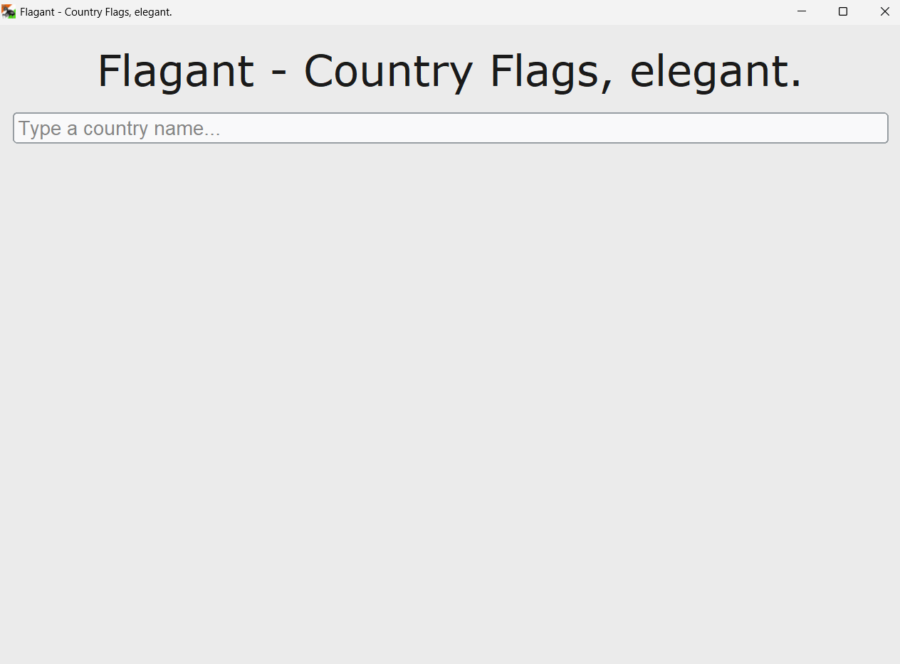
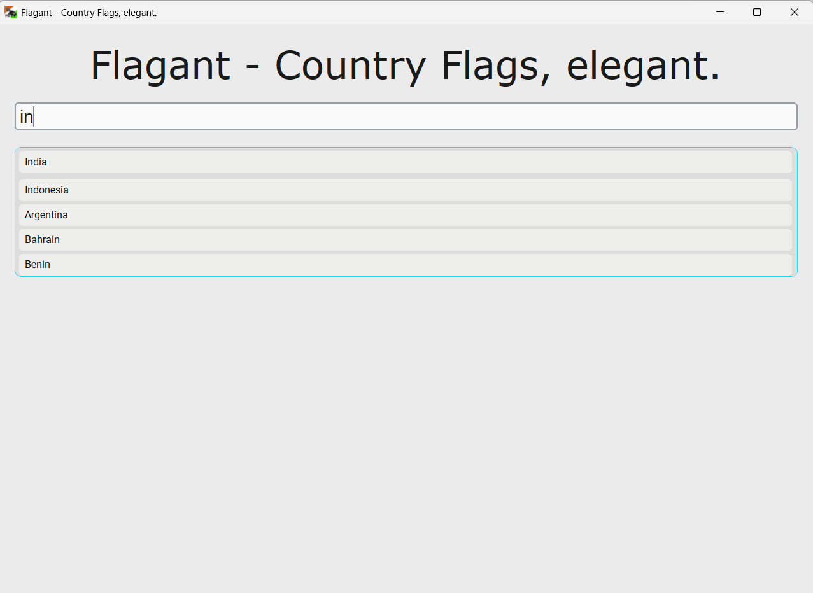
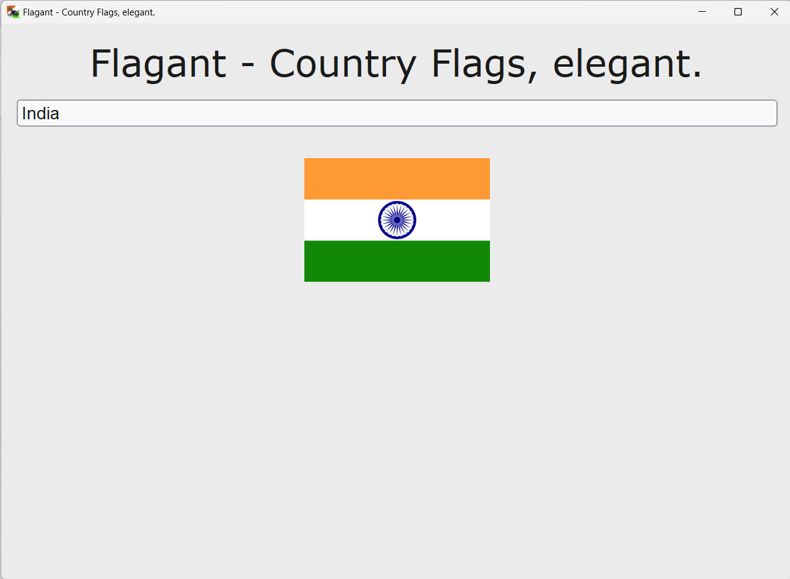
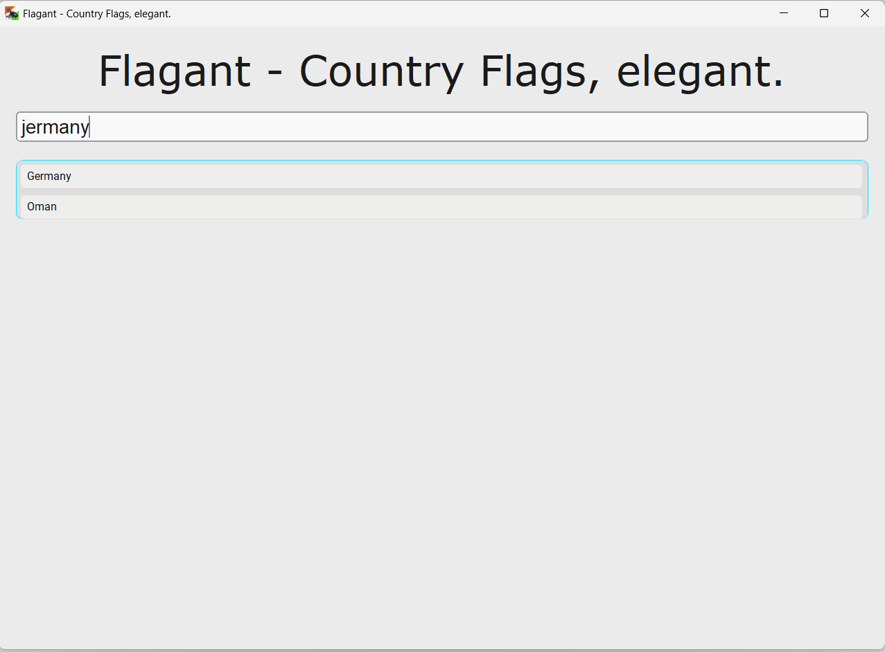

#  Flagant - Country Flags, Elegant

_**Video Demo: <https://www.youtube.com/watch?v=8aJC0TKUsjg>**_

by Ashraf Naeem \
(Github @ashrafnaeem1) \
(EdX @Red_dashes_towards_ash) \
(Email: <iamashrafnaeem@gmail.com>)

## Introduction

Flagant is an app to search and view
country flags. The app works completely
offline, and supports 255 flags as of
latest update. Countries are searched via
typo tolerant fuzzy search.

The app icon is actually a pun on the app's
name ending in 'ant' and represents an ant
with a flag behind it (the Indian national flag.)

## Setup

First of all, if you have (and want to use) the archived
distribution instead of the directly provided files
then unzip that distributed archive. You can use a GUI tool
such as 7zip or (if applicable) your own file explorer's
inbuilt file extractor. You may also use the below commands
to unzip the archive (if applicable) to a custom folder:

`cp flagant.zip custom_folder\flagant.zip`

OR

`copy flagant.zip custom_folder\flagent.zip`

then

`cd custom_folder`

`tar -xf flagant.zip`

> **Note:** Ensure you have the following required
> files and folders in your project root before proceeding:
>
> * `project.py`
> * `favicon.ico`
> * `test_project.py`
> * `flags/` (folder containing all the flag images)
>
> All these prerequisites are bundled with the project and also
> provided in the distributed archive for the project.

Install all the dependencies by running following command in
your terminal:

`pip install -r requirements.txt`

OR

`python -m pip install -r requirements.txt`

Then run:

`python ./project.py`

On windows you may have to use `python.exe` instead of `python`.

And that's it!

## Screenshots

First look at Flagant, on launch.


Searching for a country (note how closer matches are preferred.)


Showing a country flag.


Fuzzy search (for more matches and typo tolerance)


## Project Structure

```text
flagant/
├── flags/
│   ├── [country_name].png
│   └── ...
├── favicon.ico
├── requirements.txt
├── project.py
└── test_project.py
```

* `requirements`.txt lists all third party modules and is feeded into pip for setup.
* `favicon.ico` contains the icon for the program.
* `project.py` contains all the code for the app.
* `test_project.py` contains tests for some of the functions of project.py.

## History

Originally this app's catchphrase was "Flagant - Flags and anthems"
(Flagant from **Flag**s and **ant**hems.) The app was originally
intended to show country flags _while_ simultaneously playing that
country's anthem.

However I soon realized that adding the anthem feature would make the
app too complex for a simple CS50 project (a big factor was having to
find national anthems for all these countries and handle those that do
not have a readily available one.) and a simple stripped down version
supporting only the flags feature is fairly good to submit on its own.

As I preffered the name of my app to still be "Flagant", I decided to
change the catchphrase instead. So the catchphrase was changed from
"Flagant - Flags and Anthems" to "Flagant - Country **Flag**s, Eleg**ant**".

## Credits

This project has been possible thanks to python and the following libraries:

* Customtkinter: for GUI interface
* Pillow: for opening image file for displaying
* Pycountry: for country names and codes
* Rapidfuzz: for fuzzy search.

Special thanks to <https://github.com/hampusborgos/country-flags> for providing country flags.

Also, special thanks to the entire CS50p and CS50 team for such always providing amazing courses.
